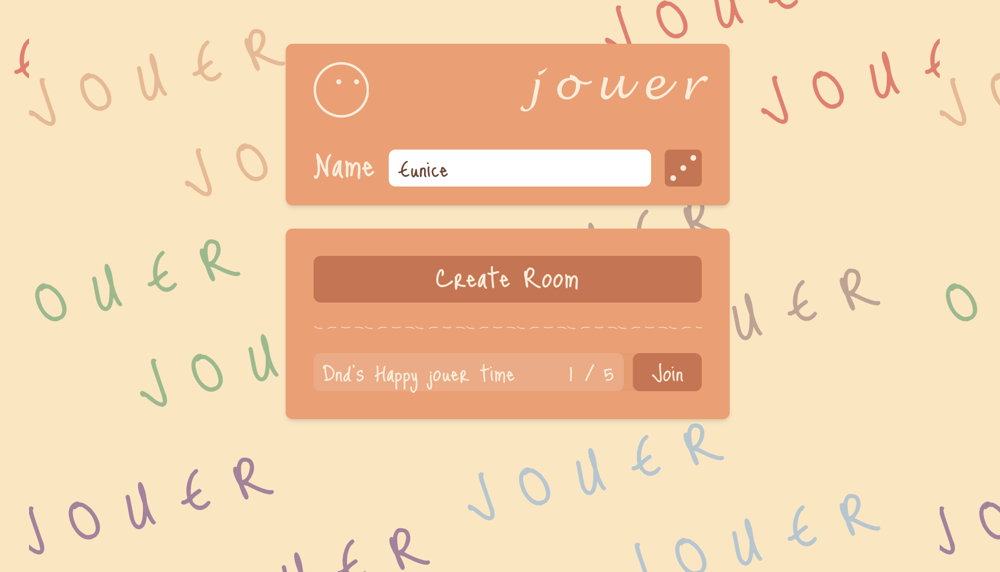
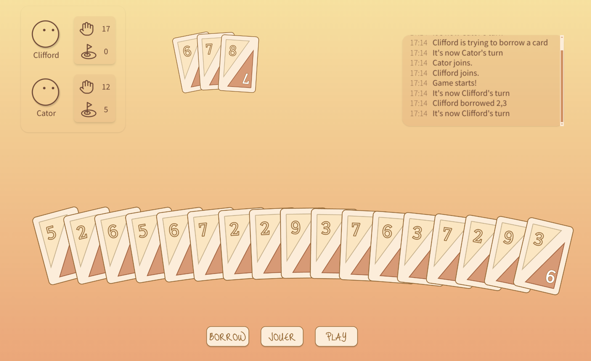

# Jouer

**Jouer** is an online multiplayer implementation of Oink Games' Scout card game, supporting 2-5 players.

🕹️ **Play Now**: It is hosted on [Fly.io](https://fly.io/), and you can access it [here](https://jouer.fly.dev/).

📚 **Game Rules**: It's a fast-paced, strategic card game where players aim to get rid of their cards by playing sets or sequences. For detailed game rules, please refer to the [Scout Rules](https://www.officialgamerules.org/card-games/scout).

## Acknowledgements

1. [Colyseus](https://www.colyseus.io/) for providing an excellent framework for building multiplayer games
2. [TOSIOS](https://github.com/halftheopposite/TOSIOS/) for inspiration on project structure and implementation
3. [Just Me Again Down Here](https://fonts.google.com/specimen/Just+Me+Again+Down+Here) and [Kreon](https://fonts.google.com/specimen/Kreon) fonts from Google Fonts
4. Oink Games for creating the original Scout card game
5. Friends who introduced me to Scout and playes it with me!

## Contact

For any questions or feedback, please open an issue in this repository.

---

Enjoy playing Scout online with your friends! 🃏
